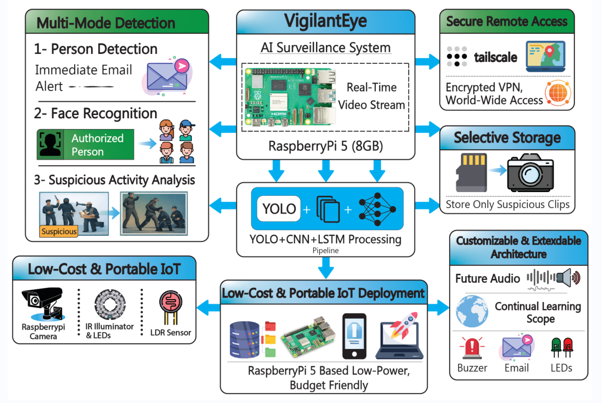

# PiLENS: Raspberry Pi–Based Deep Learning Enhanced Nightvision Surveillance System
*An IoT-based AI system for real-time suspicious activity detection using YOLO, CNN, LSTM on Raspberry Pi with nightvision camera. Features multi-mode alerts, secure remote access, and selective storage*
 
 

## Overview

PiLENS is a low-cost, portable, and intelligent surveillance system designed to enhance real-time security monitoring in low-light and night-time environments. The system leverages Raspberry Pi hardware, IR cameras, and deep learning-based AI models to detect suspicious activities automatically, providing instant alerts to the user. By combining edge computing, computer vision, and night vision technology, PiLENS aims to offer an affordable alternative to traditional high-end surveillance systems.

Key components include:
- Hardware: Raspberry Pi 5 (8GB RAM) as the core processor, Raspberry Pi Camera Module 3 (12MP NOIR with IR LEDs for nightvision), LEDs and buzzer for local alerts.
- Software: Ultralytics YOLO for person detection, CNN for feature extraction, LSTM for sequence analysis, and Flask for remote MJPEG streaming.
- Features: Multi-mode detection (basic person alert, intruder face recognition, advanced suspicious analysis), selective storage of suspicious clips, and secure remote access via Tailscale.
- Performance: Runs at 5 FPS to balance heavy ML processing on low-power hardware.

This project aims to provide a low-cost, portable solution for enhanced security, with potential extensions for audio detection and long-range wireless connectivity.

### Problem Statement:

- Traditional surveillance systems often face the following challenges:
- High costs of professional security cameras and monitoring infrastructure
- Limited intelligence, relying on human monitoring or motion detection only
- Poor low-light or night-time performance, making them ineffective during critical hours
- High false alarm rates, leading to reduced reliability and user trust

PiLENS addresses these problems by integrating AI-based activity detection with night vision capabilities on a compact Raspberry Pi platform, providing a smart, reliable, and cost-effective solution.

### Proposed Solution:

PiLENS combines hardware and software solutions:

**1. Hardware Components:**

- Raspberry Pi 5 as the main processing unit
- IR camera for night vision
- IR LEDs for low-light illumination
- Optional motion or LDR sensors for enhanced detection

**2. Software & AI Components:**

- Deep Learning models (e.g., CNN, YOLO) for real-time suspicious activity detection
- Python and OpenCV for video processing and preprocessing
- Optional Flask/Dashboard for remote monitoring
- Alert system via buzzer, email, or mobile notification

**3. Key Capabilities:**

- Detects humans and suspicious behaviors in real-time
- Operates reliably in low-light/night conditions
- Minimal false alarms due to AI-based detection
- Portable, low-cost setup suitable for universities, offices, homes, and restricted areas

### Core Features:

- Real-time AI-based detection of suspicious activities
- Night vision enabled through IR camera and LEDs
- Low-cost, compact, and portable design
- Automated alert system (optional integration with mobile or cloud)
- Expandable to multi-camera and wireless setups
- Easy setup and lightweight software requirements

### Target Users / Applications:

- University campuses and dormitories
- Warehouses and storage facilities
- Private homes for enhanced security
- Public areas requiring intelligent night surveillance
- Experimental research setups in AI and computer vision

### Future Extensions / Scalability:

- Integration of audio anomaly detection for enhanced security
- Long-range wireless connectivity for remote monitoring
- Cloud storage for video logs and alerts
- Mobile applications for live monitoring
- Multi-camera AI fusion for comprehensive coverage
- Real-time analytics dashboards

### Key Takeaways:

PiLENS is not just a surveillance tool; it is a smart, AI-powered security system designed to provide reliable detection, low-cost implementation, and scalability. Its combination of Raspberry Pi hardware, deep learning models, and night vision makes it ideal for modern security challenges, research applications, and real-life deployment scenarios.

 

 

## Key Features
- **Multi-Mode Detection**: Three modes for flexible security:
  - Mode 1: Basic person alert with immediate email (time, location, pic/video clip).
  - Mode 2: Intruder detection using face recognition, with red LED and buzzer alerts.
  - Mode 3: Advanced suspicious activity analysis via YOLO + CNN + LSTM.
- **Nightvision Capability**: 12MP NOIR camera with IR LEDs for low-light environments.
- **Secure Remote Access**: Tailscale for hack-proof worldwide viewing, with Flask-based MJPEG streaming.
- **Selective Storage**: Only saves suspicious clips to optimize storage.
- **Integrated Alerts**: Email notifications with attachments, LED/buzzer feedback, and GUI for monitoring.
- **GUI Interface**: PyQt6-based desktop app for start/stop, logs, intruder folder browser, and theme toggle (dark/light).
- **GPIO Integration**: LED and buzzer control for physical alerts (optional on non-RPi systems).

 

 

## Hardware Requirements
- Raspberry Pi 5 (8GB RAM)
- Raspberry Pi Camera Module 3 (12MP NOIR with IR LEDs + LDR illuminator)
- Red/Green LEDs + Buzzer (GPIO pins: 27 green, 17 red, 18 buzzer)
- Breadboard & Wires for connections
- Optional: Wired microphone for audio extensions

 

## Software Requirements
- Python 3.12
- Libraries: ultralytics (YOLO), picamera2, cv2 (OpenCV), numpy, PyQt6, flask, smtplib, RPi.GPIO (if on RPi)
- Install: `pip install ultralytics picamera2 opencv-python numpy pyqt6 flask RPi.GPIO`
- Model: Download "yolo11n.pt" from Ultralytics.

 

 

## Installation & Setup
1. Clone the repository: `git clone https://github.com/Huzzi-10/PiLENS-Real-Time-AI-Based-Suspicious-Activity-Detection-with-NightVision-on-Raspberry-Pi.git`
2. Navigate to the directory: `cd [Folder Name]`
3. Install dependencies: `pip install -r requirements.txt` (or above command).
4. Configure email in code: Edit SENDER_EMAIL, PASSWORD, RECEIVER_EMAIL.
5. For Tailscale: Install Tailscale on RPi, run `sudo tailscale up` for secure IP.
6. Run the program: `python [Program_File].py`

 

## Usage
- Launch the GUI and click "Start Monitoring" to begin detection.
- Person detected: Triggers alerts (email with snapshot/video, LED/buzzer).
- View logs in GUI, open Intruders folder for saved clips.
- Remote view: Use Tailscale IP + port 8000/video in browser.
- Stop monitoring to end the session.

 

## Future Work
- Integrate audio detection for suspicious sounds (e.g., glass break).
- Add long-distance wireless with NRF antenna.
- Implement continual learning for model adaptation.
- Deploy on multiple RPi devices for distributed surveillance.